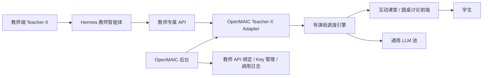

# Teacher-X 专属教师 API 接入 OpenMAIC 技术方案

## 1. 文档目的

本文档用于说明：当 Teacher-X 平台完成“教师专属 API”能力后，如何以最小侵入方式接入当前 OpenMAIC 项目，让现有的教案课堂、圆桌讨论、知识宇宙和后台管理能力能够调用真实教师分身。

接入目标不是把 OpenMAIC 改造成另一个 Teacher-X 后台，而是把 OpenMAIC 定位为“互动课堂前端与课堂调度层”，Teacher-X 定位为“教师分身能力提供方”。

## 2. 输入材料摘要

来自《互动课堂teacher-X.docx》的核心设定：

- Teacher-X 要让真实老师通过资料上传、日常使用、纠错和口述，自然沉淀出个人 AI 教师分身。
- 教师分身由 Hermes 智能体承载，负责知识存储、技能蒸馏、风格表达，并对外发布标准 API。
- OpenMAIC 负责课堂舞台、多角色同台、课件展示、文字/语音互动。
- 中间需要“导演组调度引擎”，负责课堂流程、上下文增强、多角色发言顺序、AI 同学陪练。
- 后续产品会从“答疑机器人”升级为“教学诊断与决策系统”，逐步加入诊断、处方、内容、反馈、优化闭环。

## 3. 当前项目基线

当前 OpenMAIC 项目已有以下可复用能力：

- Next.js App Router 服务端接口，核心接口在 `app/api/*`。
- 统一大模型调用层：`lib/ai/llm.ts`。
- 统一模型解析层：`lib/server/resolve-model.ts`。
- 服务端模型配置：`server-providers.yml`，读取逻辑在 `lib/server/provider-config.ts`。
- 互动课堂多 Agent 调度：`app/api/chat/route.ts`、`lib/orchestration/director-graph.ts`。
- Agent 配置体系：`lib/orchestration/registry/types.ts`、`lib/orchestration/registry/store.ts`。
- 结构化课堂动作输出：spotlight、laser、whiteboard 等动作由 `lib/orchestration/prompt-builder.ts` 和 `lib/orchestration/tool-schemas.ts` 约束。
- 知识宇宙提示词中心：`app/ops/page.tsx`、`lib/server/ops-knowledge-prompts.ts`、`lib/server/knowledge-prompt-runtime.ts`。
- 用户、会员、用量、公告、后台登录等基础设施。

因此，Teacher-X 接入应优先复用现有 `/api/chat` 和导演组能力，而不是在前端单独再做一套聊天系统。

## 4. 总体架构



核心原则：

- 前端不直接调用 Teacher-X API。
- Teacher-X API Key 只保存在 OpenMAIC 服务端。
- OpenMAIC 导演组负责决定什么时候让教师分身发言，什么时候让 AI 同学发言。
- 教师分身负责提供“老师本人风格”的教学回复。
- AI 同学、助教、补充说明仍可走当前 OpenMAIC 的通用模型池。

## 5. 接入范围

### 5.1 MVP 范围

MVP 只做最短闭环：

1. 后台录入 Teacher-X 教师 API 配置。
2. 教案课堂绑定某个 Teacher-X 教师。
3. 课堂中的主讲老师角色不再走本地 LLM，而是调用 Teacher-X API。
4. AI 同学仍走当前 OpenMAIC 模型。
5. 调用结果进入现有聊天消息流，支持文字展示和基础动作解析。
6. 记录调用日志，便于排错和计费。

### 5.2 V1 范围

1. 支持 Teacher-X 流式输出。
2. 支持 Teacher-X 返回课堂动作，如 spotlight、whiteboard。
3. 支持不同课堂绑定不同老师。
4. 支持教师 API 版本选择和回滚。
5. 支持课堂回放中标记“由 Teacher-X 教师分身生成”。

### 5.3 V2 范围

1. 接入诊断 API。
2. 接入学习处方 API。
3. 接入每日练习内容生成 API。
4. 接入学生反馈与动态优化 API。
5. 将知识宇宙、互动练习、错题本纳入 Teacher-X 学情闭环。

## 6. Teacher-X API 建议协议

### 6.1 教师课堂对话 API

建议 Teacher-X 提供统一课堂对话接口：

```http
POST /api/v1/teachers/{teacherId}/chat
Authorization: Bearer <teacher_api_key>
Content-Type: application/json
```

请求体：

```json
{
  "session_id": "classroom_123",
  "student_id": "user_456",
  "mode": "classroom",
  "stream": false,
  "teacher_version": "published",
  "context": {
    "subject": "数学",
    "chapter": "二次函数",
    "current_stage": "例题演练",
    "current_scene": {
      "id": "scene_001",
      "title": "二次函数图像性质",
      "content_summary": "讲解开口方向、对称轴和顶点"
    },
    "language_directive": "全程使用简体中文教学",
    "student_profile": {
      "nickname": "小董",
      "level": "高中",
      "known_weakness": ["函数图像", "顶点式"]
    }
  },
  "messages": [
    {
      "role": "user",
      "content": "为什么 a 大于 0 开口向上？"
    }
  ],
  "output_contract": {
    "format": "structured_array",
    "allowed_actions": ["spotlight", "laser", "wb_draw_text", "wb_draw_latex"],
    "max_text_length": 180
  }
}
```

响应体：

```json
{
  "teacher_id": "teacher_001",
  "teacher_version": "v12",
  "message": {
    "role": "teacher",
    "content": "可以把 a 想成控制开口方向的力量。a 大于 0 时，图像像碗一样向上托起。你看这个顶点两侧，函数值都会往上变大。"
  },
  "actions": [
    {
      "type": "spotlight",
      "params": {
        "elementId": "eq_1"
      }
    },
    {
      "type": "wb_draw_latex",
      "params": {
        "latex": "y=ax^2+bx+c,\\ a>0"
      }
    }
  ],
  "meta": {
    "latency_ms": 1300,
    "token_usage": {
      "input": 1200,
      "output": 160
    },
    "source": "teacher-x"
  }
}
```

### 6.2 流式响应协议

为了兼容当前 `/api/chat` 的 SSE 机制，Teacher-X 可选支持 SSE：

```http
POST /api/v1/teachers/{teacherId}/chat/stream
```

事件格式建议：

```text
event: text_delta
data: {"delta":"我们先看图像开口..."}

event: action
data: {"type":"spotlight","params":{"elementId":"img_1"}}

event: done
data: {"teacher_version":"v12","usage":{"input":1000,"output":180}}
```

OpenMAIC Adapter 负责把 Teacher-X SSE 转换为当前项目的 `StatelessEvent`。

### 6.3 诊断 API

V2 阶段接入：

```http
POST /api/v1/diagnose
```

输入：

```json
{
  "teacher_id": "teacher_001",
  "student_id": "user_456",
  "subject": "数学",
  "exam_files": [
    {
      "type": "image",
      "url": "https://..."
    }
  ],
  "teacher_rule_version": "published"
}
```

输出：

```json
{
  "weak_points": ["二次函数图像性质", "数形结合意识不足"],
  "knowledge_map": {
    "二次函数": {
      "mastery": 0.42,
      "evidence": ["错选开口方向", "顶点坐标代入错误"]
    }
  },
  "report_markdown": "本次诊断显示..."
}
```

### 6.4 学习处方 API

V2 阶段接入：

```http
POST /api/v1/plans/generate
```

输出日课表、阶段目标、每日任务、检查点。

### 6.5 反馈 API

V2 阶段接入：

```http
POST /api/v1/feedback
```

用于把学生练习结果、用时、正确率、错因回传给 Teacher-X。

## 7. OpenMAIC 后端改造方案

### 7.1 新增 Teacher-X 服务端模块

建议新增：

```text
lib/server/teacher-x/
  client.ts
  types.ts
  adapter.ts
  errors.ts
  signature.ts
```

职责：

- `client.ts`：封装 HTTP 请求、超时、重试、错误解析。
- `types.ts`：定义 Teacher-X API 请求/响应类型。
- `adapter.ts`：将 OpenMAIC 的课堂上下文转换为 Teacher-X 请求，将 Teacher-X 响应转换为 `StatelessEvent`。
- `errors.ts`：统一错误码，如 API Key 缺失、教师未发布、配额不足。
- `signature.ts`：如果 Teacher-X 要求签名，统一处理 HMAC 或 JWT。

### 7.2 新增服务端路由

建议新增内部路由：

```text
app/api/teacher-x/teachers/route.ts
app/api/teacher-x/teachers/[id]/route.ts
app/api/teacher-x/test-connection/route.ts
app/api/teacher-x/call/route.ts
```

注意：`/api/teacher-x/call` 仅供 OpenMAIC 后端内部调用或管理员测试，不建议暴露给普通用户直接调用。

### 7.3 改造 AgentConfig

当前 `AgentConfig` 已有：

```ts
{
  id: string;
  name: string;
  role: string;
  persona: string;
  allowedActions: string[];
}
```

建议扩展：

```ts
type AgentProvider = 'openmaic-llm' | 'teacher-x';

interface AgentConfig {
  id: string;
  name: string;
  role: string;
  persona: string;
  provider?: AgentProvider;
  teacherX?: {
    teacherId: string;
    version?: string;
    fallbackModel?: string;
  };
}
```

兼容策略：

- 没有 `provider` 的旧 Agent 默认使用 `openmaic-llm`。
- `role === 'teacher'` 且绑定了 `teacherX.teacherId` 时，优先调用 Teacher-X。
- Teacher-X 调用失败时，根据课堂配置决定 fallback 到本地 LLM 或提示错误。

### 7.4 改造导演组生成节点

当前多 Agent 生成入口在：

```text
lib/orchestration/director-graph.ts
```

在 `runAgentGeneration` 中增加分支：

```ts
if (agentConfig.provider === 'teacher-x' && agentConfig.teacherX?.teacherId) {
  return runTeacherXGeneration(...)
}

return runOpenMAICLLMGeneration(...)
```

`runTeacherXGeneration` 做三件事：

1. 构造 Teacher-X 请求上下文。
2. 调用 Teacher-X API。
3. 将返回的文字和动作写入现有 SSE 流。

这样前端不需要大改，仍然接收当前 `agent_start`、`text_delta`、`action`、`agent_end` 事件。

## 8. 上下文增强规则

调用 Teacher-X API 前，OpenMAIC 应注入以下上下文：

- 当前课程标题。
- 学科、年级、章节。
- 当前课件页/场景标题。
- 当前场景摘要。
- 当前白板状态摘要。
- 最近对话摘要。
- 学生昵称、会员状态、学习水平。
- 教师可用动作列表。
- 当前课堂阶段：开场、讲解、例题、提问、讨论、总结。

上下文来源映射：

| 上下文 | 当前项目来源 |
| --- | --- |
| 课程/场景 | `storeState.stage`、`storeState.scenes` |
| 当前场景 | `storeState.currentSceneId` |
| 语言约束 | `stage.languageDirective` |
| 对话历史 | `/api/chat` 请求体 `messages` |
| 角色列表 | `config.agentIds`、Agent Registry |
| 白板状态 | `whiteboardLedger` |
| 用户资料 | `userProfile` |

## 9. 数据库设计建议

### 9.1 教师 API 配置表

```sql
CREATE TABLE teacher_x_teachers (
  id varchar(36) PRIMARY KEY,
  name varchar(80) NOT NULL,
  subject varchar(32) NULL,
  api_base_url varchar(500) NOT NULL,
  api_key_encrypted text NOT NULL,
  default_version varchar(64) NULL,
  status varchar(20) NOT NULL DEFAULT 'active',
  created_by varchar(64) NOT NULL,
  created_at timestamp NOT NULL DEFAULT CURRENT_TIMESTAMP,
  updated_at timestamp NOT NULL DEFAULT CURRENT_TIMESTAMP ON UPDATE CURRENT_TIMESTAMP
);
```

### 9.2 课堂绑定表

```sql
CREATE TABLE teacher_x_classroom_bindings (
  id varchar(36) PRIMARY KEY,
  classroom_id varchar(64) NOT NULL,
  teacher_x_id varchar(36) NOT NULL,
  agent_id varchar(64) NOT NULL DEFAULT 'default-1',
  version varchar(64) NULL,
  created_at timestamp NOT NULL DEFAULT CURRENT_TIMESTAMP,
  updated_at timestamp NOT NULL DEFAULT CURRENT_TIMESTAMP ON UPDATE CURRENT_TIMESTAMP
);
```

### 9.3 调用日志表

```sql
CREATE TABLE teacher_x_call_logs (
  id varchar(36) PRIMARY KEY,
  teacher_x_id varchar(36) NOT NULL,
  user_id varchar(36) NULL,
  classroom_id varchar(64) NULL,
  session_id varchar(64) NULL,
  request_scene varchar(64) NULL,
  status varchar(20) NOT NULL,
  latency_ms int NULL,
  input_tokens int NULL,
  output_tokens int NULL,
  error_message text NULL,
  created_at timestamp NOT NULL DEFAULT CURRENT_TIMESTAMP
);
```

## 10. 后台管理改造

当前项目已有 `/ops` 管理后台。建议新增“教师 API”模块，或单独新增 `/ops/teacher-x` 子页面。

功能：

1. 新增教师 API 配置。
2. 测试连接。
3. 查看发布版本。
4. 绑定默认课堂老师。
5. 查看调用日志。
6. 设置失败兜底策略。

字段建议：

- 教师名称。
- 学科。
- API Base URL。
- API Key。
- 默认版本。
- 是否启用。
- 失败兜底：提示失败 / 使用本地模型 / 重试一次。

## 11. 前端接入点

### 11.1 教案课堂

涉及页面：

```text
app/classroom/page.tsx
app/classroom/[id]/page.tsx
components/chat/use-chat-sessions.ts
components/chat/chat-session.tsx
components/agent/agent-bar.tsx
```

前端主要变化：

- 课堂创建或进入时，读取绑定的 Teacher-X 教师。
- AgentBar 中主讲老师显示真实教师名称和头像。
- 发言消息 metadata 标记 `source: 'teacher-x'`。
- Teacher-X 不可用时显示可理解提示，不暴露 API Key 或内部异常。

### 11.2 圆桌讨论

圆桌讨论已经复用多 Agent 会话思路。接入方式：

- 主教师角色绑定 Teacher-X。
- AI 同学仍使用 OpenMAIC 通用 LLM。
- 导演组仍负责谁先说、谁补充、什么时候结束。

### 11.3 知识宇宙

知识宇宙当前是独立接口：

```text
app/api/knowledge/recall/route.ts
```

短期建议：

- 仍使用后台提示词中心控制知识宇宙。
- 不直接接 Teacher-X。

中期建议：

- 增加“知识宇宙教师来源”：OpenMAIC 提示词 / Teacher-X 教师。
- 当选择 Teacher-X 时，将白纸回忆 5 步上下文传给 Teacher-X API。

## 12. 安全与合规

必须遵守：

- API Key 只存服务端，不进入浏览器。
- Teacher-X Base URL 需要 SSRF 校验，不能允许内网地址被普通管理员随意配置。
- 调用日志不能保存完整学生敏感输入，默认只保存摘要和 token 用量。
- 教师 API 返回内容仍需走内容安全审核。
- 需要超时控制，建议 30 秒。
- 需要限流，避免单个课堂拖垮 Teacher-X 服务。
- 需要审计：谁配置了教师 API、谁测试连接、谁绑定课堂。

## 13. 错误处理策略

| 错误场景 | 用户提示 | 系统处理 |
| --- | --- | --- |
| 未绑定教师 API | 当前课堂未绑定专属教师，请联系管理员配置 | 阻断主讲教师调用 |
| API Key 错误 | 专属教师服务鉴权失败，请联系管理员 | 记录日志，不暴露 Key |
| Teacher-X 超时 | 专属教师响应超时，正在尝试备用方案 | 可 fallback 到本地模型 |
| 返回格式错误 | 专属教师返回格式异常，已切换普通回答模式 | 尝试抽取纯文本 |
| 配额不足 | 专属教师服务额度不足 | 后台告警 |

## 14. 分阶段实施计划

### 阶段 0：Mock 与协议对齐

交付：

- `lib/server/teacher-x/types.ts`
- `lib/server/teacher-x/mock-client.ts`
- `/api/teacher-x/test-connection`
- 示例 Teacher-X API 请求/响应。

验收：

- 不依赖真实 Teacher-X 服务，也能在课堂中模拟专属教师回复。

### 阶段 1：真实教师 API 接入课堂

交付：

- Teacher-X Client。
- AgentConfig 扩展。
- `director-graph.ts` 增加 Teacher-X 分支。
- 后台教师 API 配置表。
- 调用日志。

验收：

- 绑定教师后，主讲老师发言来自 Teacher-X。
- AI 同学仍来自本地模型池。
- 前端消息流不破坏。

### 阶段 2：课堂动作与流式体验

交付：

- Teacher-X SSE 转 OpenMAIC SSE。
- Teacher-X actions 转现有 action 事件。
- 课堂回放记录 Teacher-X 来源。

验收：

- Teacher-X 能控制 spotlight、laser、whiteboard。
- 流式输出不卡顿。

### 阶段 3：诊断与处方闭环

交付：

- 诊断 API 接入。
- 学习报告页。
- 处方计划页。
- 错题本/互动练习反馈回传。

验收：

- 上传试卷或错题后生成诊断报告。
- 根据诊断报告生成学习计划。
- 学生练习结果能回传并触发优化建议。

## 15. 开发任务拆解

P0：

- 新增 Teacher-X API 类型定义。
- 新增 Teacher-X 服务端 Client。
- 新增教师 API 配置表和调用日志表。
- 后台新增教师 API 配置页面。
- 修改 AgentConfig，支持 `provider: 'teacher-x'`。
- 修改 `director-graph.ts`，主讲教师可走 Teacher-X。
- 保证 `/api/chat` SSE 输出兼容现有前端。

P1：

- 支持 Teacher-X 流式输出。
- 支持 Teacher-X 返回课堂动作。
- 支持课堂绑定不同教师。
- 支持失败兜底策略。
- 增加调用监控与后台可视化。

P2：

- 接入诊断 API。
- 接入处方 API。
- 接入反馈 API。
- 与错题本、练习、知识宇宙联动。

## 16. 技术风险

### 16.1 Teacher-X 返回格式不可控

解决方案：

- 强制 Teacher-X 支持 `output_contract`。
- OpenMAIC Adapter 做容错解析。
- 无法解析动作时保留纯文本。

### 16.2 课堂延迟变高

解决方案：

- Teacher-X 支持 SSE。
- OpenMAIC 设置超时和 fallback。
- AI 同学继续使用低成本快速模型，避免所有角色都压到 Teacher-X。

### 16.3 教师风格和课堂动作冲突

解决方案：

- 教师风格由 Teacher-X 控制。
- 课堂动作由 OpenMAIC 的 `allowedActions` 和导演组约束。
- Teacher-X 只允许返回白名单动作。

### 16.4 数据安全

解决方案：

- API Key 加密存储。
- 后台权限隔离。
- 调用日志脱敏。
- Base URL SSRF 校验。

## 17. 推荐结论

最推荐的落地方式：

1. 保留当前 OpenMAIC 的导演组和多角色课堂架构。
2. 把 Teacher-X 作为一种新的 Agent Provider 接入。
3. 主讲老师角色走 Teacher-X API。
4. AI 同学、助教和补充角色继续走 OpenMAIC 现有模型池。
5. 先完成课堂互动闭环，再做诊断、处方、反馈闭环。

这样改造成本最低，也最符合当前项目结构。

